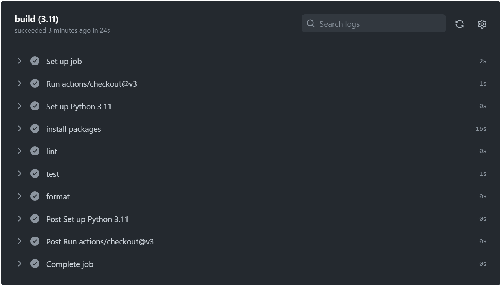

[][def]

# SQLite Lab - Week 5 mini project

## The current implementation of the Mini-project can be executed as follows:

1. All dependencies needed for execution can be found in the [requirement.txt](https://github.com/nogibjj/oo46_sqlite-lab/blob/main/requirements.txt) file.

   - To run the application, simply run: make run / python main.py in your prefered terminal

2. The main purpose of this application is to connect to an SQLite database and perform some basic sql queries.

## Mini-project deliverables:

### Application output:

### Testing outcome:

### Github actions:

[def]: https://github.com/nogibjj/oo46_sqlite-lab/actions/workflows/cicd.yml
